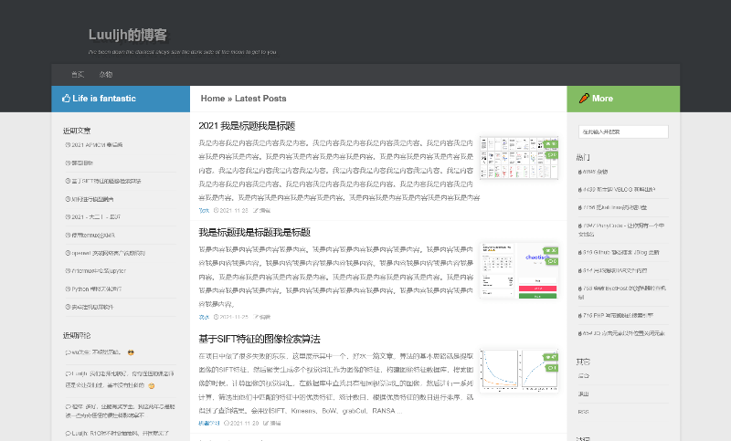

Hufman 主题 Hufman
---

## 主题截图


## 自定义文章封面
若文章内部有图片，则自动选取第一张作为封面图。在编辑文章处添加自定义字段`thumb`，填写图片URL即可强制设置文章封面，若填写0，则选取随机图片。默认在未设置封面图像且文章无图情况下展示随机图像，可在后台关闭。

## 代码高亮插件
主题原本自带高亮，版本0.3.9开始移除自带高亮，改用插件高亮。这里提供他人所写的插件，作者为Copterfly，[点我下载](../Plugins/CodeHighlighter.zip)。

## 右侧栏添加内容
后台可以添加右栏HTML输出，参考格式为：
```html
<ul class="sb-widget">
    <p class="cleartext">标题</p>
    <li><a href="http://example.com/">一栏</a></li>
    <li><a href="http://example.com/">二栏</a></li>
</ul>
```

**其他注意事项：**
0.3.8版本修改了文章浏览量的代码，如果从之前版本更新到0.3.8版本，会出现*热门文章*一栏中热度为0，但点进文章后就正常的情况，建议执行以下SQL代码解决这个问题，若文章很少也可以手动浏览文章来解决。
```sql
UPDATE `typecho_fields` SET `int_value` = `str_value`+0 WHERE `name` = 'views' and `type` = 'str'
```

若启用主题后无法正常评论，请在[后台]->[设置]->[评论]里关闭`开启反垃圾保护`这一选项☑.


## 近期更新
2022/8/1
1. Latex公式渲染改为优先使用外部资源
2. 添加图片查看器
3. 优化返回顶部 纵享丝滑
4. 添加颜表情 ᕕ( ᐛ )ᕗ

...